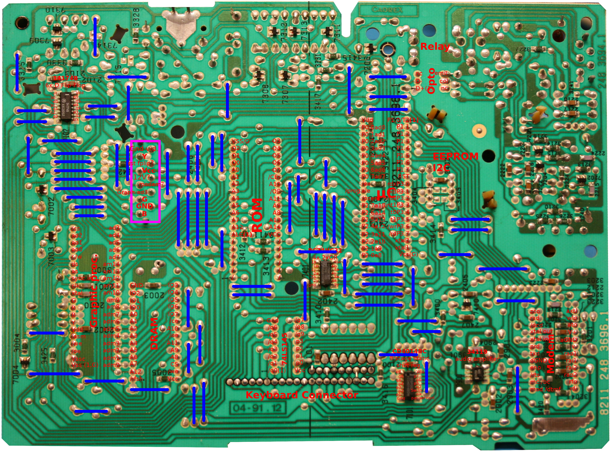

# Hacker le Minitel 2

Hier, j'ai ouvert le Minitel 2 pour y passer ma curiosité, le nettoyer (il sent après 1/4 d'heure de travail) et enlever la fiche téléphonique qui ne sert plus à rien.

Si vous voulez quelques photographies durant le démontage, voyez [l'article pary sur le blog](xx).

# Détails de la carte

Les images hautes résolutions ci-dessous présente la carte principale microcontrôleur avec de nombreuses informations.

## Carte de face

J'ai collecté les __fiches techniques des composants__ disponibles dans l'archive:
* [minitel-datasheets.zip](minitel-datasheets.zip)

Ayant poussé la curiosité dans la création d'un ordinateur 8Bit ([Bravo Projet sur le blog](https://arduino103.blogspot.com/search?q=bravo)) mais aussi la programmation Intel 8088 (bientôt sur le blog)... avoir un processeur Intel (80c32) et une ROM permet d'envisager bien des possibilités. Cela passera par la capture du contenu de la ROM, le décodage des instructions... et envisager la modification du comportement du Minitel 2.

## Carte de dos (brochage)

La capture ci-dessous (très haute définition) reprend la carte de dos, avec identification des composants et des broches. Les pontages filaires (sur le dessus de la carte) sont également repris.

Le but est de pouvoir redessiner les bus et les relations entre les différents composants. Cela facilitera l'éventuel décodage de la ROM.

Le lien ci-dessous conduit au fichier Gimp permettant de masquer ou pas certains calques.

* [carte de dos (fichier xcf)](Minitel2-MainBoard-back.xcf)

# Idée de Hacking
1. Réutiliser les boutons Appel/raccrocher pour en faire une fonctionnalité complémentaire
2. La ROM est sur un socket... il est donc envisageable de la modifier pour activer le mode terminal dès la mise sous tension.

# A suivre

C'est encore loin d'être terminé...
