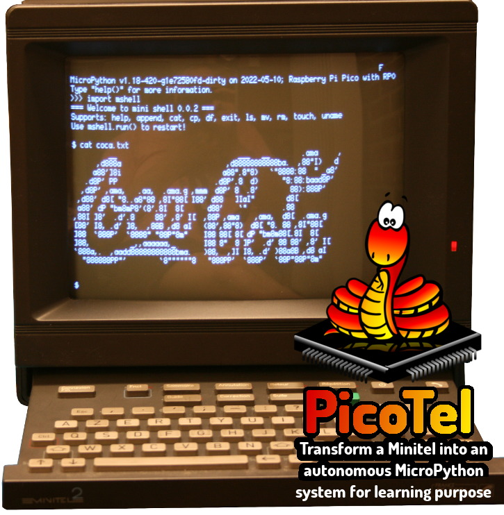
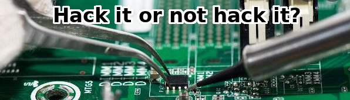

# PicoTel : Raspberry-Pi Pico + Minitel pour créer un système autonome

Le but du projet PicoTel est de créer un système complètement autonome autour du terminal Minitel.



Par autonomie, il faut comprendre:
* Gestion de fichier (done with mshell)
* Editeur de code
* Execution de code (done with REPL thanks to `import module_name`)
* Transfert avec un ordinateur (done, tanks to Pico USB and MPRemote or ThonnyIDE)

__Hacking or not hacking__<br />
 <br />
Bien que cela ne soit pas nécessaire pour profiter des bienfait de MicroPython sur votre Minitel 2... l'idée de pouvoir hacker le Minitel reste quelque-chose de très captivant. [Les développements du hacking fait l'objet d'une page séparée](docs/minitel2_hack/minitel2_hack.md).

# Matériel
Connecteur UART côté minitel


Fiche DIN 5 positions


# Minitel en mode Terminal

Avant quoi que ce soit d'autre, il faut pouvoir configurer le Minitel en mode terminal.

Cela se fait avec les combinaisons de touches décrites ci-dessous. Un signe "+" indique que les touches doivent être pressées en même temps.
Le "-->" indique une séquence de touches (ou séquence de combinaisons de touches) à suivre.

Passage en mode terminal
* __Fnct+Sommaire__ : passage du mode Répertoire au mode Terminal
* __Fnct+T --> A__ : Mode périphérique USA
* __Fnct+T , F__ : Mode périphérique Français (pas toujours fonctionnel)
* __Fnct+T , E__ : désactiver l'ECHO local
* __Fnct+P , 4__ : débit 4800 bauds (toujours disponible)
* __Fnct+P , 9__ : débit 9600 bauds (Minitel 2 uniquement)

Voyez le document [readme_fnct.md](readme_fnct.md) pour plus de combinaisons de touches.

# MicroPython + DupTerm

Le Pico doit exécuter une version de MicroPython implémentant `os.dupterm()` dans le firmware MicroPython.

## Comment vérifier la présence de `dupterm()` ?

1. Ouvrir une session REPL sur le Pico à l'aide de ThonnyIDE ou RShell ou MPRemote
2. Saisir le code suivant dans la session REPL. Si la fonction `dupterm()` existe alors microPython doit simplement nous dire que c'est une fonction:
``` python
>>> import os
>>> # ne pas inclure les parenthèses!
>>> os.dupterm
<function>
>>>
```
Super! La fonction `dupterm()` est bien disponible dans le firmware :-)<br />
Si REPL retourne une erreur alors il faut installer une version de MicroPython avec le support `dupterm()`.

## Installer MicroPython avec support `dupterm()` :

Dans la version MicroPython 1.18 (jan 2022), `dupterm()` n'est pas encore inclus. J'ai donc recompilé un "MicroPython + DupTerm pour RaspberryPi Pico" inclus dans ce dépôt.
1. Télécharger et décompresser le fichier [_firmware/pico-dupterm-uf2.zip](_firmware/pico-dupterm-uf2.zip) --> Le fichier `firmware.uf2` est maintenant disponible.
2. Presser le bouton "Boot0" du pico en le mettant sous tension --> Le Pico affiche un système de fichiers sur l'ordinateur (comme une Clé USB).
3. Copier le fichier `firmware.uf2` (par glissé/dépossé) dans le lecteur de Pico.<br />Après quelques secondes, le Pico redémarre et le lecteur disparaît.


# PicoTel SANS contrôle de flux


Cette implémentation fonctionne correctement mais nécessite néanmoins un temps de pause (500 ms) après chaque opération `print()` pour éviter de surcharger le l'UART du Minitel.

Une implémentation avec contrôle matériel du flux (Device Ready) sera mise en oeuvre (voir plus bas).

## REPL via UART

Il faut maintenant permettre au Pico de dialoguer avec le terminal du Minitel.

Voici comment tester cette connexion:
1. Etablir une session REPL avec le Raspberry-Pi Pico (via USB avec Thonny IDE, MPRemote ou RShell)
2. Initialiser UART du Pico raccorder raccorder sur le Minitel
3. Repliquer la session REPL sur l'UART.

```
$ mpremote
Connected to MicroPython at /dev/ttyACM0
Use Ctrl-] to exit this shell

>>> from machine import UART
>>> ser = UART( 0, 9600, bits=7, parity=2, stop=1 )
>>> from os import dupterm
>>> dupterm( ser )
```

Il est maintenant possible de saisir des commandes Python directement sur le Minitel.

# PicoTel AVEC contrôle de flux MATERIEL

En cours de construction ...

Cette implémentation utilise le signal "Device Ready" du minitel pour suspendre l'émission de donnée vers le minitel lorsque son UART est saturé.


# Créer un système autonome

Pour créer un système autonome, il faut pouvoir faire toutes les opérations nécessaire (même le coding de script) depuis le Minitel.

Voici les différentes éléments mis en oeuvre.

## Boot.py
Le fichier [boot.py](lib/boot.py) proposé ici, initialise automatiquement l'UART en 9600 bauds sur le Pico du fait un `dupterm()` sur l'UART.

Le script boot.py utilise également un switch (RunApp, sur le GPIO16) permettant d'inhiler/activer la création de l'UART et le réplication de REPL. Cela permet de récupérer la main sur le Raspberry-Pi Pico depuis un ordinateur même si quelque-chose se passe mal.

La LED sur GPIO 25 du Pico s'allume lorsque REPL est répliqué sur l'UART.


## mshell.py
Le projet __MShell__ (minimalist shell) est une ligne de commande de type Linux écrit en MycroPython. MShell est conçu pour apporter un support rudimentaire de gestion de fichiers. Avec mshell is est possible de créer/effacer/voir/copier/déplacer les fichiers directement depuis la session REPL.

Une copie des fichiers __MShell__ est disponible dans le sous-répertoire [lib/](lib) .

Le projet inclus par ailleurs un fichier d'aide (`mshell.txt`) décrivant les commandes et leurs possibilités.

__MShell__ peut-être démarré depuis REPL en saississant `import mshell` (ou redémarré avec `mshell.run()` ).

L'image d'accueil de ce readme présente justement l'utilisation de MShell sur le Minitel, résultant des saisies suivantes:

```
MPY: soft reboot
Running PicoTel


MicroPython v1.18-420-g1e72580fd-dirty on 2022-05-10; Raspberry Pi Pico with RP2040
Type "help()" for more information.
>>> import mshell
=== Welcome to mini shell 0.0.2 ===
Supports: help, append, cat, cp, df, exit, ls, mv, rm, touch, uname
Use mshell.run() to restart!

$ cat coca.txt
         __                              ___   __        .ama     ,
      ,d888a                          ,d88888888888ba.  ,88"I)   d
     a88']8i                         a88".8"8)   `"8888:88  " _a8'
   .d8P' PP                        .d8P'.8  d)      "8:88:baad8P'
  ,d8P' ,ama,   .aa,  .ama.g ,mmm  d8P' 8  .8'        88):888P'
 ,d88' d8[ "8..a8"88 ,8I"88[ I88' d88   ]IaI"        d8[
 a88' dP "bm8mP8'(8'.8I  8[      d88'    `"         .88
,88I ]8'  .d'.8     88' ,8' I[  ,88P ,ama    ,ama,  d8[  .ama.g
[88' I8, .d' ]8,  ,88B ,d8 aI   (88',88"8)  d8[ "8. 88 ,8I"88[
]88  `888P'  `8888" "88P"8m"    I88 88[ 8[ dP "bm8m88[.8I  8[
]88,          _,,aaaaaa,_       I88 8"  8 ]P'  .d' 88 88' ,8' I[
`888a,.  ,aadd88888888888bma.   )88,  ,]I I8, .d' )88a8B ,d8 aI
  "888888PP"'        `8""""""8   "888PP'  `888P'  `88P"88P"8m"


$
```

## Echange Ordinateur <-> Pico

L'interface USB-Serie du Raspberry-Pi Pico reste totalement accessible et fonctionnelle.

Il est donc possible de connecter le Pico sur un ordinateur et d'échanger des fichiers avec vos utilitaires habituelles __sans avoir besoin de déconnecter le Pico du Minitel__.

Outils pour travailler avec votre Pico.
* MPRemote
* ThonnyIDE
* RShell

## Limitation du clavier Minitel

Le clavier ne permet pas de saisir certains caractères:
* _ : (underscore) parfois utilisé dans les noms de fichiers

# Ressources complémentaires
* [Mode d'emploi du Minitel 2 (Philips)](docs/mode-d-emploi-minitel- 2-philips.pdf) (_pdf_)
* [Mode d'emploi du Minitel 2 (Philips, détaillé)](docs/mode-d-emploi-minitel- 2-philips-detaille.pdf) (_pdf_)
* [Schéma Minitel](docs/sch_minitel.pdf) (_pdf_)
* [RX-TX Minitel](docs/RX-TX-Minitel.jpg) (_png_)
* [ASCII - American Standard Code for Information Interchange](https://fr.wikipedia.org/wiki/American_Standard_Code_for_Information_Interchange) (_Wikipedia.fr_)

Lectures complémentaires:
* [Minitel branché sur mon Raspberry-Pi Pico](https://arduino103.blogspot.com/2022/04/minitel-branche-sur-mon-raspberry-pi.html)
* [univ-toulouse.fr - grundman - Modems-HOWTO-8](http://www.math.univ-toulouse.fr/~grundman/linux/HOWTO/Modems-HOWTO-8.html) (_ne semble plus accessible_)
* [From Trash to Treasure: How to Resurrect a Minitel Terminal](https://duino4projects.com/from-trash-to-treasure-how-to-resurrect-a-minitel-terminal/)

# Shopping list
* DIN Audio/Video Connector, plug, 5 Pos - PS000178, MultiCom Pro [available at Farnell](https://be.farnell.com/pro-signal/ps000178/din-audio-video-conn-plug-5pos/dp/2911032)
* [Raspberry-Pi Pico](https://shop.mchobby.be/product.php?id_product=2025) @ MCHobby
* [4 bits Level Shifter](https://shop.mchobby.be/product.php?id_product=131) @ MCHobby
